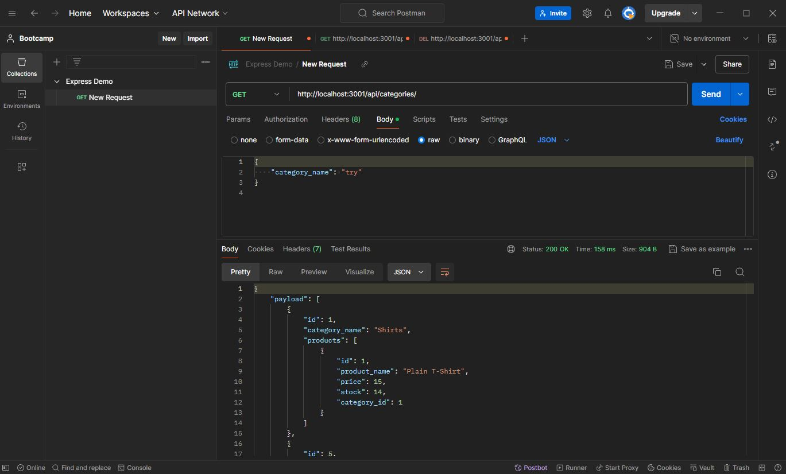

# E-commerce Design

## Description
This application is a mock-up of an e-commerce back end database. It allows you to connect to a database, seed data into it, and then proceed to use RESTful to do get, put, post, and delete methods and have the database correctly display the information back.

## Visuals
*  Here is a screenshot of a Postman get route.

* [Link to video demonstration](https://drive.google.com/file/d/1qZJ5UN8job2ABGZVs2pRsl37UF0oB5KQ/view?usp=sharing)

## Usage
This application is a test of my knowledge and abilities to take starter-code that was given to me and correctly get the back-end up and running. When using postman to mock data, all routes should be displaying and working correctly as they are intended using the RESTful method. This is also for grading purposes.

## Acknowledgments
Thank you to 
* [Dotenv](https://www.npmjs.com/package/dotenv)
* [Express](https://www.npmjs.com/package/express)
* [Pg](https://www.npmjs.com/package/pg)
* [Sequelize](https://www.npmjs.com/package/sequelize) 

for allowing me to use their packages.

## Support
If you have any issues with this repo, shoot me an email at walterty89@gmail.com. 

[Here is a link to my GitHub](https://github.com/TyWalter) if you would prefer to contact me this way.